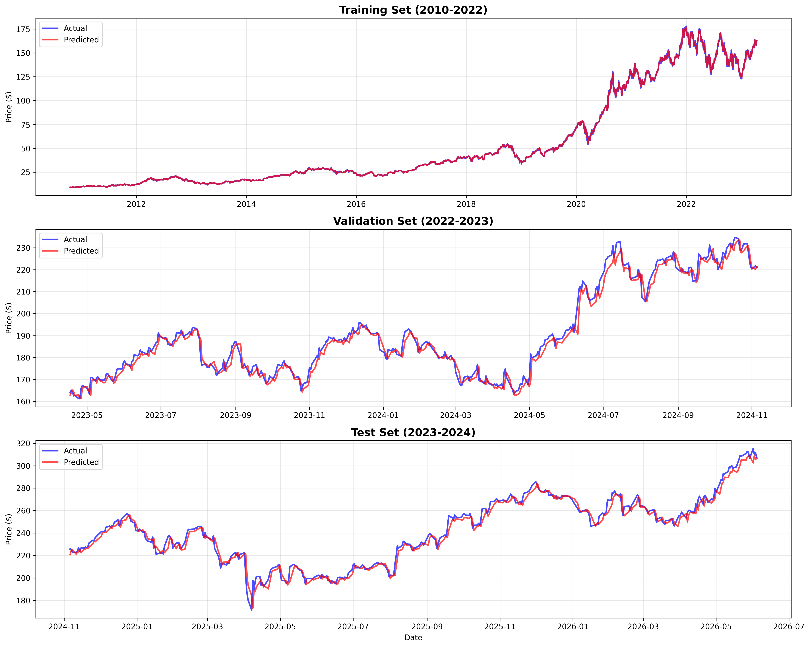
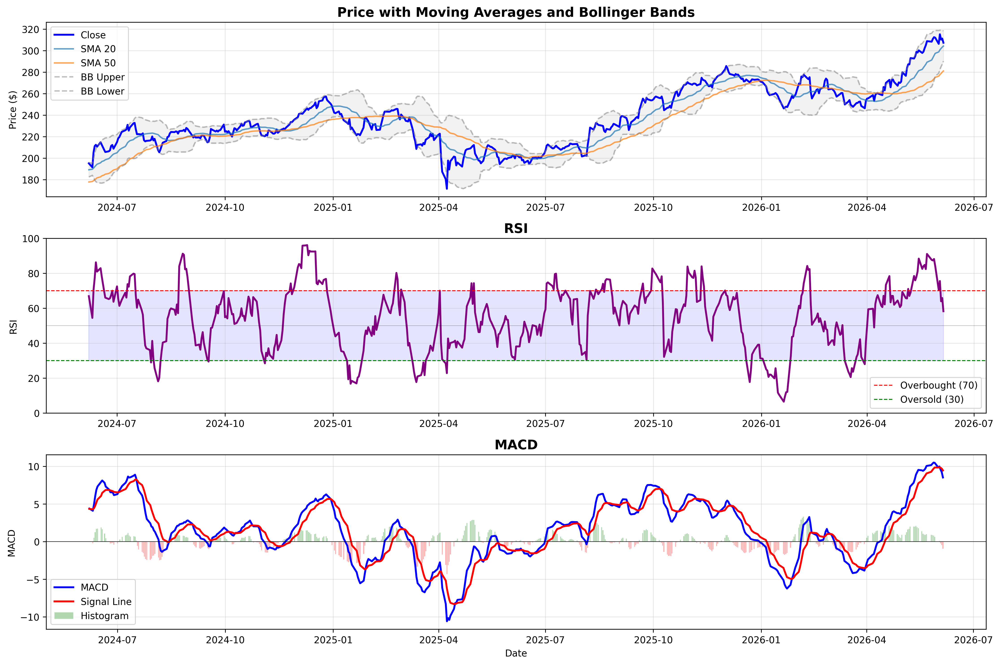
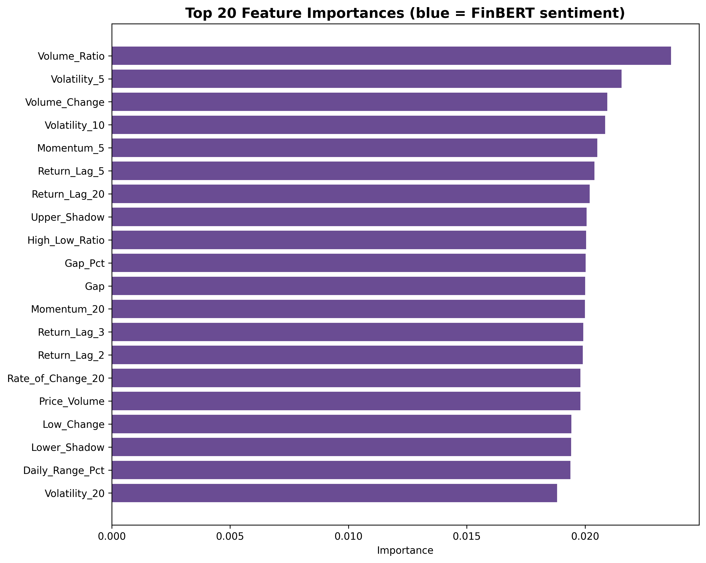

# Apple Stock Return Forecasting

An end-to-end machine learning pipeline investigating whether technical indicators yield a reliable directional edge on next-day AAPL returns using Random Forest Regression.


## Overview

This project applies supervised machine learning to financial time series forecasting. The pipeline engineers 60+ features from 15 years of AAPL price and volume data, trains a Random Forest regressor to predict next-day percentage returns, and evaluates directional accuracy on a held-out test set.

**Key finding:** Technical indicators alone do not yield a reliable directional edge on daily AAPL returns. The model achieves ~65% directional accuracy on training data but drops to ~49–51% on out-of-sample data — statistically indistinguishable from random. This result is consistent with the Efficient Market Hypothesis: in a heavily traded large-cap stock, technical patterns are rapidly arbitraged away.

The project's value is in the rigor of the pipeline and the diagnosis of *why* the model fails — not in producing inflated accuracy numbers.

## Results

| Split | Period | Directional Accuracy | MAE |
|---|---|---|---|
| Training | 2010–2022 | 65.2% | $0.52 |
| Validation | 2022–2023 | 51.5% | $2.25 |
| Test | 2023–2024 | 48.6% | $2.08 |

The sharp drop from training to validation/test accuracy is a clear signature of overfitting — the model learns noise patterns in the training data that do not generalize.

## Model Performance



- **Training Set (top)**: Model tracks in-sample prices closely
- **Validation Set (middle)**: Generalization begins to break down
- **Test Set (bottom)**: Predictions revert toward a naive baseline

## Technical Indicators



RSI, MACD, and Bollinger Bands are included as momentum and volatility signals. Despite their widespread use in technical analysis, none produced reliable out-of-sample directional signal in this study.

## Feature Importance



The model distributes importance across many features rather than concentrating on a few — a pattern that often indicates the model is fitting noise rather than a stable signal.

## Technical Approach

### Return-Based Prediction

Rather than predicting absolute prices — which breaks down when test prices exceed the training range — the model predicts next-day percentage returns:

```python
# Scale-invariant target
target = (tomorrow_close - today_close) / today_close
predicted_price = today_close * (1 + predicted_return)
```

### Feature Set (60+ indicators)

**Trend:** SMA (5, 10, 20, 50, 200-day), EMA (10, 20, 50-day), price position relative to moving averages, SMA crossover signals

**Momentum:** RSI, MACD + signal line + histogram, rate of change (10, 20-day), momentum (5, 10, 20-day as pct_change)

**Volatility:** Bollinger Bands (upper, lower, width, position), ATR, rolling std (5, 10, 20-day)

**Lag features:** Return lags (1, 2, 3, 5, 10, 20-day), volume lags — raw price lags excluded to avoid leakage

**Volume:** Volume SMAs, volume ratio, price-volume interaction

**Price patterns:** Candlestick body/shadow ratios, daily range %, gap %

### Model

```python
RandomForestRegressor(
    n_estimators=500,
    max_depth=10,
    min_samples_split=20,
    min_samples_leaf=10,
    max_features='sqrt',
    random_state=42
)
```

### Data Split (chronological — no shuffling)

| Split | Period | Days |
|---|---|---|
| Training (80%) | 2010–2022 | ~2,858 |
| Validation (10%) | 2022–2023 | ~358 |
| Test (10%) | 2023–2024 | ~358 |

Chronological ordering is strictly enforced throughout. Raw OHLCV columns are excluded from the feature matrix — only engineered features are passed to the model — to prevent lookahead bias.

## What I Learned

**Overfitting is the central challenge.** Even with regularized hyperparameters (`max_depth=10`, `min_samples_leaf=10`), the model memorizes training patterns that don't generalize. Daily stock returns are dominated by noise, and a 60+ feature space gives the model too many opportunities to fit that noise.

**The EMH holds here.** AAPL is one of the most liquid, most-watched stocks in the world. Any technical pattern that reliably predicted next-day direction would be arbitraged away almost immediately. This doesn't mean ML has no role in quantitative finance — it means daily technical indicators on a single large-cap equity are a weak signal source.

**What might actually help:**
- Higher-frequency data (intraday) where microstructure effects are more exploitable
- Alternative data sources: earnings sentiment, options flow, macro indicators
- Cross-asset features: sector ETFs, VIX, yield curve
- Shorter-horizon models that are less exposed to news-driven overnight gaps

## Limitations

- Technical data only — no fundamentals, sentiment, or macro features
- Single asset — no cross-sectional or portfolio-level analysis
- Daily resolution — microstructure effects that drive HFT alpha are invisible here
- No transaction costs, slippage, or market impact modeled
- Directional accuracy alone is not a sufficient basis for a trading strategy

## Future Work

- Incorporate earnings sentiment and options flow data
- Extend to multi-asset cross-sectional modeling
- Experiment with walk-forward validation instead of a single fixed split
- Try gradient boosting (XGBoost/LightGBM) with tighter regularization
- Explore intraday data to access higher signal-to-noise regimes

## Installation

```bash
pip install -r requirements.txt
```

Requires Python 3.8+.

## Usage

```bash
python quantbacktester.py
```

## Project Structure

```
quant-backtester/
├── quantbacktester.py    # Main pipeline
├── README.md
├── requirements.txt
└── images/
    ├── predictions_all_sets.png
    ├── technical_indicators.png
    └── feature_importance.png
```

## Data Source

Yahoo Finance via `yfinance`.

## License

MIT License. For educational purposes only. Not financial advice.


