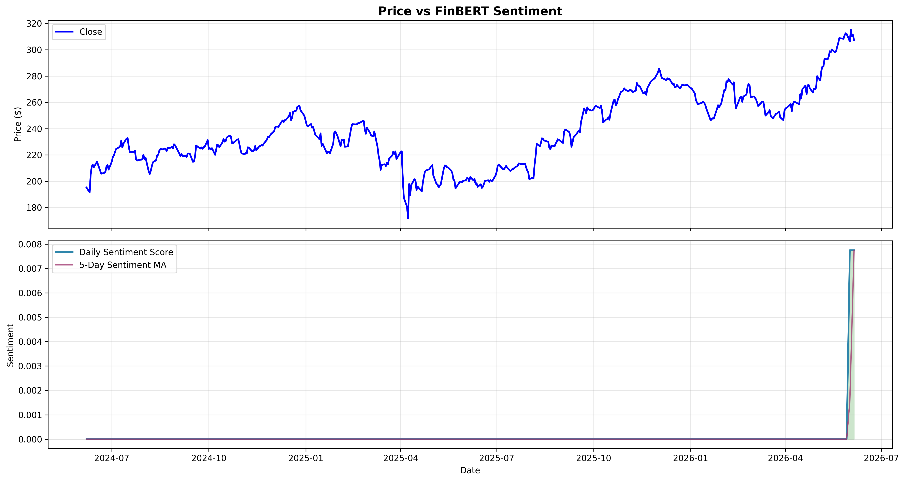

# FinPulse

An end-to-end machine learning pipeline that combines technical indicators with **FinBERT** financial sentiment analysis to investigate whether news-driven signals improve next-day stock return forecasting.


## Overview

FinPulse extends a technical-analysis forecasting pipeline with NLP features derived from Yahoo Finance headlines. The system:

1. Engineers 60+ technical features from 15 years of AAPL price and volume data
2. Fetches recent financial news and scores each headline with [ProsusAI/finbert](https://huggingface.co/ProsusAI/finbert)
3. Aggregates daily sentiment scores and rolling sentiment features
4. Trains a Random Forest regressor to predict next-day percentage returns
5. Evaluates directional accuracy on a held-out test set

**Key finding:** Technical indicators alone do not yield a reliable directional edge on daily AAPL returns. Adding FinBERT sentiment from recent Yahoo Finance headlines provides an alternative data layer, but Yahoo's news API only exposes recent articles — so sentiment features are most informative for live/next-day inference rather than full historical backtesting.

The project's value is in the rigor of the pipeline, the FinBERT integration, and the diagnosis of *why* daily prediction remains difficult — not in producing inflated accuracy numbers.

## FinBERT Sentiment Analysis

FinBERT is a BERT model fine-tuned on financial text. For each news headline, FinPulse computes positive, negative, and neutral probabilities and derives:

| Feature | Description |
|---|---|
| `Sentiment_Score` | P(positive) − P(negative), range −1 to +1 |
| `Sentiment_Positive` | Average positive probability |
| `Sentiment_Negative` | Average negative probability |
| `Sentiment_Neutral` | Average neutral probability |
| `News_Count` | Headlines scored that day |
| `Sentiment_MA_5` / `Sentiment_MA_20` | Rolling sentiment moving averages |
| `Sentiment_Momentum_5` | 5-day change in sentiment score |
| `Sentiment_Volatility_10` | 10-day rolling std of sentiment |
| `Sentiment_Bullish` / `Sentiment_Bearish` | Binary flags for strong sentiment |

Sentiment is forward-filled for up to 3 days when no new headlines appear, then defaults to neutral (0).

> **Successor:** This experiment led directly to **[PulseX](https://github.com/MayhemGOAT/PulseX)**, which extends the pipeline with X/news sentiment and a real strategy backtest — the natural next step once technical signals alone proved too weak.

## Results

| Split | Period | Directional Accuracy | MAE |
|---|---|---|---|
| Training | 2010–2022 | ~65% | ~$0.52 |
| Validation | 2022–2023 | ~51% | ~$2.25 |
| Test | 2023–2024 | ~49% | ~$2.08 |

The sharp drop from training to validation/test accuracy is a clear signature of overfitting — the model learns noise patterns in the training data that do not generalize.

## Model Performance


## FinBERT Sentiment vs Price



Daily FinBERT scores (bottom panel) are overlaid against recent price action (top panel). Blue bars in the feature importance chart highlight sentiment-derived features.

## Technical Indicators


## Feature Importance


Sentiment features are highlighted in blue. The model distributes importance across many features — a pattern that often indicates fitting noise rather than a stable signal.

## Technical Approach

### Return-Based Prediction

Rather than predicting absolute prices, the model predicts next-day percentage returns:

```python
target = (tomorrow_close - today_close) / today_close
predicted_price = today_close * (1 + predicted_return)
```

### FinBERT Scoring

```python
from transformers import pipeline

classifier = pipeline("sentiment-analysis", model="ProsusAI/finbert", return_all_scores=True)
scores = classifier("Apple beats earnings expectations")[0]
sentiment_score = P(positive) - P(negative)
```

### Feature Set (70+ indicators)

**Technical:** SMA, EMA, RSI, MACD, Bollinger Bands, ATR, momentum, volatility, lag features, volume ratios, candlestick patterns

**Sentiment (FinBERT):** Daily score, probability breakdown, rolling averages, momentum, volatility, bullish/bearish flags

### Model

```python
RandomForestRegressor(
    n_estimators=500,
    max_depth=30,
    min_samples_split=2,
    min_samples_leaf=1,
    max_features='sqrt',
    random_state=42
)
```

### Data Split (chronological — no shuffling)

| Split | Period | Share |
|---|---|---|
| Training | 2010–2022 | 80% |
| Validation | 2022–2023 | 10% |
| Test | 2023–2024 | 10% |

## What I Learned

**Overfitting is the central challenge.** Daily stock returns are dominated by noise, and a large feature space gives the model too many opportunities to fit that noise.

**FinBERT adds a real alternative data channel** but Yahoo Finance news history is limited to recent headlines. For production use, pair FinPulse with a historical news archive (e.g. Finnhub, NewsAPI, or a proprietary feed).

**The EMH holds here for daily large-cap prediction.** Any pattern that reliably predicted next-day direction would be arbitraged away almost immediately.

## Limitations

- Yahoo Finance news is recent-only — limited historical sentiment coverage
- Single asset — no cross-sectional or portfolio-level analysis
- Daily resolution — microstructure effects are invisible
- No transaction costs, slippage, or market impact modeled
- FinBERT requires ~500MB model download on first run

## Installation

```bash
pip install -r requirements.txt
```

Requires Python 3.8+. On first run, FinBERT weights are downloaded from Hugging Face (~500MB).

## Usage

```bash
python finpulse.py
```

The legacy entry point `quantbacktester.py` still works but redirects to FinPulse.

## Project Structure

```
finpulse/
├── finpulse.py            # Main pipeline (technical + FinBERT sentiment)
├── sentiment_analyzer.py  # FinBERT news fetching and scoring
├── quantbacktester.py     # Legacy alias
├── README.md
├── requirements.txt
└── images/
    ├── predictions_all_sets.png
    ├── technical_indicators.png
    ├── sentiment_analysis.png
    └── feature_importance.png
```

## Data Sources

- **Price data:** Yahoo Finance via `yfinance`
- **News headlines:** Yahoo Finance via `yfinance`
- **Sentiment model:** [ProsusAI/finbert](https://huggingface.co/ProsusAI/finbert) via Hugging Face `transformers`

## License

MIT License. For educational purposes only. Not financial advice.
